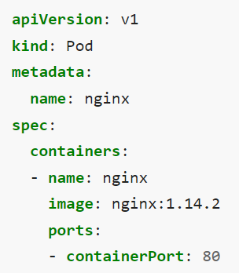
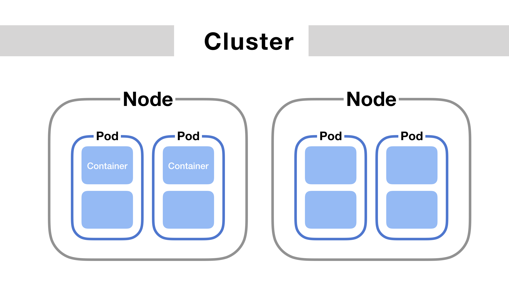
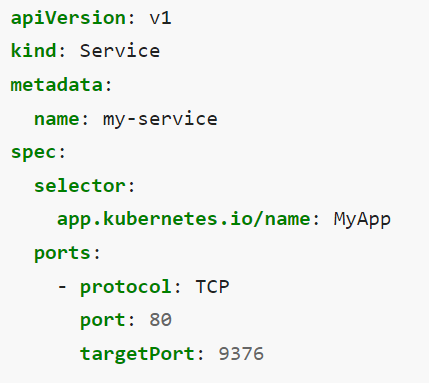
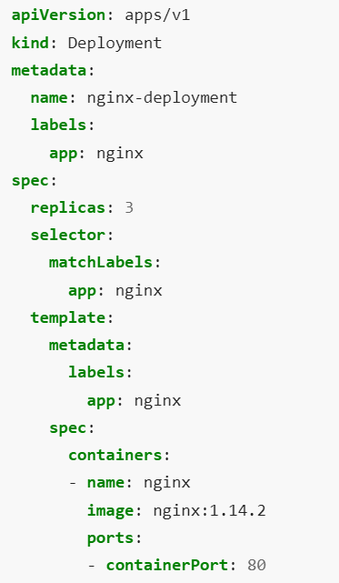

# Table of Content

- [Introduction to Kubernetes](#introduction-to-kubernetes)
- [Pods, Services and deployments](#pods-services-and-deployments)
- [Related reading](#related-reading)
- [Questions](#questions)

# Introduction to Kubernetes

Kubernetes is a portable, extensible, open source platform for managing containerized workloads and services, that facilitates both declarative configuration and automation. It has a large, rapidly growing ecosystem. Kubernetes services, support, and tools are widely available.

It is a container orchestration platform. In order to understand what exactly that means, it helps to revisit the purpose of containers, what's missing, and how Kubernetes fills that gap.

Containers provide a lightweight mechanism for isolating an application's environment. For a given application, we can specify the system configuration and libraries we want installed without worrying about creating conflicts with other applications that might be running on the same physical machine. We encapsulate each application as a container image which can be executed reliably on any machine* (as long as it has the ability to run container images), providing us the portability to enable smooth transitions from development to deployment. Additionally, because each application is self-contained without the concern of environment conflicts, it's easier to place multiple workloads on the same physical machine and achieve higher resource (memory and CPU) utilization - ultimately lowering costs.

However, what happens if your container dies? Or even worse, what happens if the machine running your container fails? Containers do not provide a solution for fault tolerance. Or what if you have multiple containers that need the ability to communicate, how do you enable networking between containers? How does this change as you spin up and down individual containers? Container networking can easily become an entangled mess. Lastly, suppose your production environment consists of multiple machines - how do you decide which machine to use to run your container?

We can address many of the concerns mentioned above using Kubernetes - a container orchestration platform. It manages the entire lifecycle of individual containers, spinning up and shutting down resources as needed. If a container shuts down unexpectedly, the orchestration platform will react by launching another container in its place. On top of this, the orchestration platform provides a mechanism for applications to communicate with each other even as underlying individual containers are created and destroyed.

## Containers

Each container that you run is repeatable; the standardization from having dependencies included means that you get the same behavior wherever you run it.

Containers decouple applications from underlying host infrastructure. This makes deployment easier in different cloud or OS environments.

A [container image](#container-images) is a ready-to-run software package, containing everything needed to run an application: the code and any runtime it requires, application and system libraries, and default values for any essential settings.

By design, a container is immutable: you cannot change the code of a container that is already running. If you have a containerized application and want to make changes, you need to build a new image that includes the change, then recreate the container to start from the updated image

### Container images

A container image represents binary data that encapsulates an application and all its software dependencies. Container images are executable software bundles that can run standalone and that make very-well defined assumptions about their runtime environment.

You typically create a container image of your application and push it to a registry before referring to it in a Pod.
Container images are usually given a name such as pause, example/mycontainer, or kube-apiserver. Images can also include a registry hostname; for example: fictional.registry.example/imagename, and possibly a port number as well; for example: fictional.registry.example:10443/imagename.

If you don't specify a registry hostname, Kubernetes assumes that you mean the Docker public registry.

After the image name part you can add a tag (in the same way you would when using with commands like docker or podman). Tags let you identify different versions of the same series of images.

Image tags consist of lowercase and uppercase letters, digits, underscores (_), periods (.), and dashes (-).
There are additional rules about where you can place the separator characters (_, -, and .) inside an image tag.
If you don't specify a tag, Kubernetes assumes you mean the tag `latest`.

When you first create a Deployment, StatefulSet, Pod, or other object that includes a Pod template, then by default the pull policy of all containers in that pod will be set to IfNotPresent if it is not explicitly specified. This policy causes the kubelet to skip pulling an image if it already exists

## Pods, Services and Deployments

Every Pod in a cluster gets its own unique cluster-wide IP address. This means you do not need to explicitly create links between Pods and you almost never need to deal with mapping container ports to host ports.
This creates a clean, backwards-compatible model where Pods can be treated much like VMs or physical hosts from the perspectives of port allocation, naming, service discovery, load balancing, application configuration, and migration.

Kubernetes imposes the following fundamental requirements on any networking implementation (barring any intentional network segmentation policies):
- pods can communicate with all other pods on any other node without NAT
- agents on a node (e.g. system daemons, kubelet) can communicate with all pods on that node

### Using Pods
Pods are the smallest deployable units of computing that you can create and manage in Kubernetes.

A Pod (as in a pod of whales or pea pod) is a group of one or more containers, with shared storage and network resources, and a specification for how to run the containers. A Pod's contents are always co-located and co-scheduled, and run in a shared context. A Pod models an application-specific "logical host": it contains one or more application containers which are relatively tightly coupled. In non-cloud contexts, applications executed on the same physical or virtual machine are analogous to cloud applications executed on the same logical host.

The shared context of a Pod is a set of Linux namespaces, cgroups, and potentially other facets of isolation - the same things that isolate a container. Within a Pod's context, the individual applications may have further sub-isolations applied.

A Pod is similar to a set of containers with shared namespaces and shared filesystem volumes

The following is an example of a Pod which consists of a container running the image nginx:1.14.2.

To create the Pod shown above, run the following command:

`kubectl apply -f https://k8s.io/examples/pods/simple-pod.yaml)`

Usually you don't need to create Pods directly, even singleton Pods. Instead, create them using workload resources such as Deployment or Job. If your Pods need to track state, consider the StatefulSet resource.

Pods in a Kubernetes cluster are used in two main ways:
- Pods that run a single container. The "one-container-per-Pod" model is the most common Kubernetes use case; in this case, you can think of a Pod as a wrapper around a single container; Kubernetes manages Pods rather than managing the containers directly.
- Pods that run multiple containers that need to work together. A Pod can encapsulate an application composed of multiple co-located containers that are tightly coupled and need to share resources. These co-located containers form a single cohesive unit of service—for example, one container serving data stored in a shared volume to the public, while a separate sidecar container refreshes or updates those files. The Pod wraps these containers, storage resources, and an ephemeral network identity together as a single unit.

Pods are designed to support multiple cooperating processes (as containers) that form a cohesive unit of service. The containers in a Pod are automatically co-located and co-scheduled on the same physical or virtual machine in the cluster. The containers can share resources and dependencies, communicate with one another, and coordinate when and how they are terminated.

For example, you might have a container that acts as a web server for files in a shared volume, and a separate "sidecar" container that updates those files from a remote source, as in the following diagram:

### Using Services

Kubernetes Pods are created and destroyed to match the desired state of your cluster. Pods are nonpermanent resources. If you use a Deployment to run your app, it can create and destroy Pods dynamically.

Each Pod gets its own IP address, however in a Deployment, the set of Pods running in one moment in time could be different from the set of Pods running that application a moment later.

This leads to a problem: if some set of Pods (call them "backends") provides functionality to other Pods (call them "frontends") inside your cluster, how do the frontends find out and keep track of which IP address to connect to, so that the frontend can use the backend part of the workload?

Enter Services.

A Service in Kubernetes is a REST object, similar to a Pod. Like all the REST objects, you can POST a Service definition to the API server to create a new instance. The name of a Service object must be a valid RFC 1035 label name.

For example, suppose you have a set of Pods where each listens on TCP port 9376 and contains a label app.kubernetes.io/name=MyApp:

### Using Deployments

A Deployment provides declarative updates for Pods and ReplicaSets.

You describe a desired state in a Deployment, and the Deployment Controller changes the actual state to the desired state at a controlled rate. You can define Deployments to create new ReplicaSets, or to remove existing Deployments and adopt all their resources with new Deployments.

The following is an example of a Deployment. It creates a ReplicaSet to bring up three nginx Pods:

In this example:
- A Deployment named nginx-deployment is created, indicated by the .metadata.name field.
- The Deployment creates three replicated Pods, indicated by the .spec.replicas field.
- The .spec.selector field defines how the Deployment finds which Pods to manage. In this case, you select a label that is defined in the Pod template (app: nginx). However, more sophisticated selection rules are possible, as long as the Pod template itself satisfies the rule.
- The template field contains the following subfields:
  - The Pods are labeled `app: nginx` using the `.metadata.labels` field.
  - The Pod template's specification, or `.template.spec` field, indicates that the Pods run one container, `nginx`, which runs the `nginx` Docker Hub image at version 1.14.2.
  - Create one container and name it `nginx` using the `.spec.template.spec.containers[0].name` field.

# Related reading

- [Introduction to Kubernetes](https://www.digitalocean.com/community/tutorials/an-introduction-to-kubernetes)
- [Kubernetes architecture](https://kubernetes.io/docs/concepts/overview/components/)
- [Kubernetes objects](https://medium.com/devops-mojo/kubernetes-objects-resources-overview-introduction-understanding-kubernetes-objects-24d7b47bb018)
- [Workload resources](https://kubernetes.io/docs/concepts/workloads/controllers/)

# Questions

- What is Kubernetes?
- What is the difference between Kubernetes and Docker?
- What is architecture of kubernetes?
- What are the advantages of Kubernetes?
- What are the disadvantages of Kubernetes?
- Imagine you need to create a scalable microservices system. Describe which Kubernetes objects you will use?
