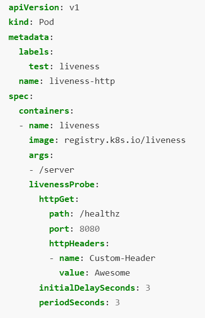

# Table of Content

- [Kubernetes Persistent Storage](#kubernetes-persistent-storage)
- [Health checks for microservices application](#health-checks-for-microservices-application)
- [Liveness & Readiness probes in Kubernetes](#liveness--readiness-probes-in-kubernetes)
- [Deployment strategies](#deployment-strategies)
- [Related reading](#related-reading)
- [Questions](#questions)

# Kubernetes Persistent Storage
Kubernetes Persistent Storage offers Kubernetes applications a convenient way to request, and consume, storage resources. A Volume is a basic building block of the Kubernetes storage architecture. Kubernetes Persistent Volumes are a type of Volume that lives within the Kubernetes cluster, and can outlive other Kubernetes pods to retain data for long periods of time.

Other central Kubernetes storage concepts include Persistent Volume Claims, which are requests by Kubernetes nodes for storage resources, and Storage Classes, which define types of storage, allowing Kubernetes resources to access Kubernetes storage solutions without knowing their underlying implementation.

Containers are immutable, meaning that when a container shuts down, all data created during its lifetime is lost. This is suitable for some applications, but in many cases, applications need to preserve state or share information with other applications, a common example is applications that rely on databases.

Kubernetes provides a convenient persistent storage mechanism for containers. It is based on the concept of a Persistent Volume (PV). Kubernetes Volumes are constructs that allow you to mount a storage unit, such as a file system folder or a cloud storage bucket, to a Kubernetes node and also share information between nodes. Regular Volumes are deleted when the Pod hosting them shuts down. But a Persistent Volume is hosted in its own Pod and can remain alive for as long as necessary for ongoing operations.

## Persistent Volumes
Kubernetes persistent volumes (PVs) are a unit of storage provided by an administrator as part of a Kubernetes cluster. Just asa  node is a computing resource used by the cluster, a PV is a storage resource. Persistent volumes are independent of the lifecycle of the pod that uses it, meaning that even if the pod shuts down, the data in the volume is not erased. They are defined by an API object, which captures the implementation details of storage such as NFS file shares, or specific cloud storage systems.

Kubernetes persistent volumes are administrator-provided volumes. They have predefined properties including file system, size, and identifiers like volume ID and name. In order for a Pod to start using these volumes, it must request a volume by issuing a persistent volume claim (PVC). PVCs describe the storage capacity and characteristics a pod requires, and the cluster attempts to match the request and provision the desired persistent volume. There are two related concepts you should understand as you start working with Kubernetes persistent volumes:

### Storage classes
The StorageClass object allows cluster administrators to define PVs with different properties, like performance, size or access parameters. It lets you expose persistent storage to users while abstracting the details of storage implementation. There are many predefined StorageClasses in Kubernetes (see the following section), or you can create your own.Administrators can define several StorageClasses that give users multiple options for performance. For example, one can be on a fast SSD drive but with limited capacity, and one on a slower storage service which provides high capacity.
### Persistent Volume Claims
This is a request sent by a Kubernetes node for storage. The claim can include specific storage parameters required by the application—for example an amount of storage, or a specific type of access (read/write, read-only, etc.). Kubernetes looks for a PV that meets the criteria defined in the user’s PVC, and if there is one, it matches claim to PV. This is called binding. You can also configure the cluster to dynamically provision a PV for a claim.

To bind a pod to a PV, the pod must contain a volume mount and a PVC. These declarations allow users to mount PVs in pods without knowing the details of the underlying storage equipment.

There are two options for mounting PVs to a pod:
- __Static configuration__ involves administrators manually creating PVs and defining a StorageClass that matches the criteria of these PVs. When a pod uses a PVC that specifies the StorageClass, it gains access to one of these static PVs.
- __Dynamic configuration__ occurs when there is no static PV that matches the PVC. In this case, the Kubernetes cluster provisions a new PV based on the StorageClass definitions.

# Health checks for microservices application

A health check is a special REST API implementation that you can use to validate the status of a microservice and its dependencies. With MicroProfile Health, microservices can self-check their health and publish their overall status to a defined endpoint.

A health check can assess anything that a microservice needs, including dependencies, system properties, database connections, endpoint connections, and resource availability. The overall status of the microservice depends on whether all the configured health checks pass. A microservice is considered available and reports UP status if all the configured health checks are successful. If one or more health checks fail, the microservice is considered unavailable and reports a DOWN status. Services can report their availability to a defined endpoint by implementing the API that is provided by MicroProfile Health. A service orchestrator can use these status reports to decide how to manage and scale the microservices within an application. Health checks can also interact with Kubernetes liveness and readiness probes.

Forces:
- An alert should be generated when a service instance fails
- Requests should be routed to working service instances

Solution:
A service has health check API endpoint (e.g. HTTP /health) that returns the health of the service. The API endpoint handler performs various checks, such as
- the status of the connections to the infrastructure services used by the service instance
- the status of the host, e.g. disk space
- application specific logic 

A health check client - a monitoring service, service registry or load balancer - periodically invokes the endpoint to check the health of the service instance.

This pattern has the following benefits:
- The health check endpoint enables the health of a service instance to be periodically tested

This pattern has the following drawbacks:
- The health check might not sufficiently comprehensive or the service instance might fail between health checks and so requests might still be routed to a failed service instance

# Liveness & Readiness probes in Kubernetes
## Liveness probe
The kubelet uses liveness probes to know when to restart a container. For example, liveness probes could catch a deadlock, where an application is running, but unable to make progress. Restarting a container in such a state can help to make the application more available despite bugs.

The kubelet uses readiness probes to know when a container is ready to start accepting traffic. A Pod is considered ready when all of its containers are ready. One use of this signal is to control which Pods are used as backends for Services. When a Pod is not ready, it is removed from Service load balancers.

The kubelet uses startup probes to know when a container application has started. If such a probe is configured, it disables liveness and readiness checks until it succeeds, making sure those probes don't interfere with the application startup. This can be used to adopt liveness checks on slow starting containers, avoiding them getting killed by the kubelet before they are up and running.

A kind of liveness probe uses an HTTP GET request. Here is the configuration file for a Pod that runs a container based on the registry.k8s.io/liveness image.

In the configuration file, you can see that the Pod has a single container. The periodSeconds field specifies that the kubelet should perform a liveness probe every 3 seconds. The initialDelaySeconds field tells the kubelet that it should wait 3 seconds before performing the first probe. To perform a probe, the kubelet sends an HTTP GET request to the server that is running in the container and listening on port 8080. If the handler for the server's /healthz path returns a success code, the kubelet considers the container to be alive and healthy. If the handler returns a failure code, the kubelet kills the container and restarts it.

Any code greater than or equal to 200 and less than 400 indicates success. Any other code indicates failure.

## Readiness probe
Sometimes, applications are temporarily unable to serve traffic. For example, an application might need to load large data or configuration files during startup, or depend on external services after startup. In such cases, you don't want to kill the application, but you don't want to send it requests either. Kubernetes provides readiness probes to detect and mitigate these situations. A pod with containers reporting that they are not ready does not receive traffic through Kubernetes Services.

## Configure probes
Probes have a number of fields that you can use to more precisely control the behavior of startup, liveness and readiness checks:
- initialDelaySeconds: Number of seconds after the container has started before startup, liveness or readiness probes are initiated. Defaults to 0 seconds. Minimum value is 0.
- periodSeconds: How often (in seconds) to perform the probe. Default to 10 seconds. Minimum value is 1.
- timeoutSeconds: Number of seconds after which the probe times out. Defaults to 1 second. Minimum value is 1.
- successThreshold: Minimum consecutive successes for the probe to be considered successful after having failed. Defaults to 1. Must be 1 for liveness and startup Probes. Minimum value is 1.
- [failureThreshold: When a probe fails, Kubernetes will try failureThreshold times before giving up. Giving up in case of liveness probe means restarting the container. In case of readiness probe the Pod will be marked Unready. Defaults to 3. Minimum value is 1.

# Deployment strategies
There are a variety of techniques to deploy new applications to production, so choosing the right strategy is an important decision, weighing the options in terms of the impact of change on the system, and on the end-users.

The amount deployment strategies is various. Here are most popular of them:
- Recreate: Version A is terminated then version B is rolled out.
- Ramped (also known as rolling-update or incremental): Version B is slowly rolled out and replacing version A.
- Blue/Green: Version B is released alongside version A, then the traffic is switched to version B.
- Canary: Version B is released to a subset of users, then proceed to a full rollout.
- A/B testing: Version B is released to a subset of users under specific condition.
- Shadow: Version B receives real-world traffic alongside version A and doesn’t impact the response.

Here is the description for each one of them: [deployment strategies](https://thenewstack.io/deployment-strategies/).

# Related reading

- [Kubernetes Persistent Volume Claims explained](https://cloud.netapp.com/blog/cvo-blg-kubernetes-persistent-volume-claims-explained)
- [Local Persistent Volumes](https://vocon-it.com/2018/12/20/kubernetes-local-persistent-volumes)
- [Health check pattern](https://microservices.io/patterns/observability/health-check-api.html)
- [Kubernetes probes](https://kubernetes.io/docs/tasks/configure-pod-container/configure-liveness-readiness-startup-probes)
- [Deployment strategies](https://thenewstack.io/deployment-strategies)
- [Kubernetes labels](https://kubebyexample.com/concept/labels)
- [Deployment history](https://kubernetes.io/docs/concepts/workloads/controllers/deployment/#rolling-back-a-deployment)

# Questions

- Why do we need health checks for applications?
- What is the difference between Kubernetes probes?
- What is the best storage for environment variables for your Kubernetes pod? What if these variables are sensitive?
- Why should we use deployment strategies? What types of deployments strategies do you know?
- How can you roll back to the previous version of deployment in Kubernetes?
