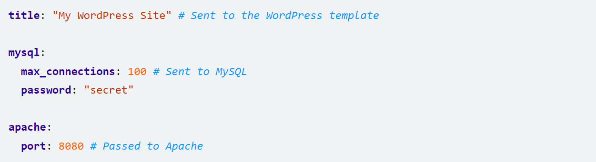

# Table of Content

- [Kubernetes Persistent Storage](#kubernetes-persistent-storage)
- [Helm chart](#helm-chart)
- [Related reading](#related-reading)
- [Questions](#questions)

# Kubernetes Persistent Storage
Kubernetes Persistent Storage offers Kubernetes applications a convenient way to request, and consume, storage resources. A Volume is a basic building block of the Kubernetes storage architecture. Kubernetes Persistent Volumes are a type of Volume that lives within the Kubernetes cluster, and can outlive other Kubernetes pods to retain data for long periods of time.

Other central Kubernetes storage concepts include Persistent Volume Claims, which are requests by Kubernetes nodes for storage resources, and Storage Classes, which define types of storage, allowing Kubernetes resources to access Kubernetes storage solutions without knowing their underlying implementation.

Containers are immutable, meaning that when a container shuts down, all data created during its lifetime is lost. This is suitable for some applications, but in many cases, applications need to preserve state or share information with other applications, a common example is applications that rely on databases.

Kubernetes provides a convenient persistent storage mechanism for containers. It is based on the concept of a Persistent Volume (PV). Kubernetes Volumes are constructs that allow you to mount a storage unit, such as a file system folder or a cloud storage bucket, to a Kubernetes node and also share information between nodes. Regular Volumes are deleted when the Pod hosting them shuts down. But a Persistent Volume is hosted in its own Pod and can remain alive for as long as necessary for ongoing operations.

## Persistent Volumes
Kubernetes persistent volumes (PVs) are a unit of storage provided by an administrator as part of a Kubernetes cluster. Just asa  node is a computing resource used by the cluster, a PV is a storage resource. Persistent volumes are independent of the lifecycle of the pod that uses it, meaning that even if the pod shuts down, the data in the volume is not erased. They are defined by an API object, which captures the implementation details of storage such as NFS file shares, or specific cloud storage systems.

Kubernetes persistent volumes are administrator-provided volumes. They have predefined properties including file system, size, and identifiers like volume ID and name. In order for a Pod to start using these volumes, it must request a volume by issuing a persistent volume claim (PVC). PVCs describe the storage capacity and characteristics a pod requires, and the cluster attempts to match the request and provision the desired persistent volume. There are two related concepts you should understand as you start working with Kubernetes persistent volumes:

### Storage classes
The StorageClass object allows cluster administrators to define PVs with different properties, like performance, size or access parameters. It lets you expose persistent storage to users while abstracting the details of storage implementation. There are many predefined StorageClasses in Kubernetes (see the following section), or you can create your own.Administrators can define several StorageClasses that give users multiple options for performance. For example, one can be on a fast SSD drive but with limited capacity, and one on a slower storage service which provides high capacity.
### Persistent Volume Claims
This is a request sent by a Kubernetes node for storage. The claim can include specific storage parameters required by the application—for example an amount of storage, or a specific type of access (read/write, read-only, etc.). Kubernetes looks for a PV that meets the criteria defined in the user’s PVC, and if there is one, it matches claim to PV. This is called binding. You can also configure the cluster to dynamically provision a PV for a claim.

To bind a pod to a PV, the pod must contain a volume mount and a PVC. These declarations allow users to mount PVs in pods without knowing the details of the underlying storage equipment.

There are two options for mounting PVs to a pod:
- __Static configuration__ involves administrators manually creating PVs and defining a StorageClass that matches the criteria of these PVs. When a pod uses a PVC that specifies the StorageClass, it gains access to one of these static PVs.
- __Dynamic configuration__ occurs when there is no static PV that matches the PVC. In this case, the Kubernetes cluster provisions a new PV based on the StorageClass definitions.

# Helm chart
Helm is widely known as "the package manager for Kubernetes". Although it presents itself like this, its scope goes way beyond that of a simple package manager. However, let's start at the beginning. 
Helm is an open-source project which was originally created by DeisLabs and donated to CNCF, which now maintains it. The original goal of Helm was to provide users with a better way to manage all the Kubernetes YAML files we create on Kubernetes projects. 
The path Helm took to solve this issue was to create Helm Charts. Each chart is a bundle with one or more Kubernetes manifests – a chart can have child charts and dependent charts as well.
This means that Helm installs the whole dependency tree of a project if you run the `install` command for the top-level chart. You just a single command to install your entire application, instead of listing the files to install via `kubectl`.

Helm uses a packaging format called charts. A chart is a collection of files that describe a related set of Kubernetes resources. A single chart might be used to deploy something simple, like a memcached pod, or something complex, like a full web app stack with HTTP servers, databases, caches, and so on. 
Charts are created as files laid out in a particular directory tree. They can be packaged into versioned archives to be deployed.

## Scope, Dependencies and Values
Values file can declare values for the top-level chart, as well as for any of the charts that are included in that chart's charts/ directory. Or, to phrase it differently, a values file can supply values to the chart as well as to any of its dependencies. For example, the demonstration WordPress chart above has both mysql and apache as dependencies. The values file could supply values to all of these components:



Charts at a higher level have access to all the variables defined beneath. So the WordPress chart can access the MySQL password as .Values.mysql.password. But lower level charts cannot access things in parent charts, so MySQL will not be able to access the title property. Nor, for that matter, can it access apache.port.

Values are namespaced, but namespaces are pruned. So for the WordPress chart, it can access the MySQL password field as .Values.mysql.password. But for the MySQL chart, the scope of the values has been reduced and the namespace prefix removed, so it will see the password field simply as .Values.password.

## Named templates
A named template (sometimes called a partial or a subtemplate) is simply a template defined inside a file, and given a name. One popular naming convention is to prefix each defined template with the name of the chart: `{{ define "mychart.labels" }}`. By using the specific chart name as a prefix we can avoid any conflicts that may arise due to two different charts that implement templates of the same name.

The `define` action allows us to create a named template inside a template file. Its syntax goes like this:
````
{{- define "MY.NAME" }}
# body of template here
{{- end }}
````
Now we can embed this template inside our existing ConfigMap, and then include it with the template action:
````
{{- define "mychart.labels" }}
labels:
generator: helm
date: {{ now | htmlDate }}
{{- end }}
apiVersion: v1
kind: ConfigMap
metadata:
name: {{ .Release.Name }}-configmap
{{- template "mychart.labels" }}
data:
myvalue: "Hello World"
{{- range $key, $val := .Values.favorite }}
{{ $key }}: {{ $val | quote }}
{{- end }}
````
When the template engine reads this file, it will store away the reference to `mychart.labels` until template `mychart.labels` is called. Then it will render that template inline. So the result will look like this:
````
# Source: mychart/templates/configmap.yaml
apiVersion: v1
kind: ConfigMap
metadata:
  name: running-panda-configmap
  labels:
    generator: helm
    date: 2016-11-02
data:
  myvalue: "Hello World"
  drink: "coffee"
  food: "pizza"
````

# Related reading

- [Kubernetes Persistent Volume Claims explained](https://cloud.netapp.com/blog/cvo-blg-kubernetes-persistent-volume-claims-explained)
- [Local Persistent Volumes](https://vocon-it.com/2018/12/20/kubernetes-local-persistent-volumes)
- [Helm tutorial for beginners](https://blog.packagecloud.io/what-is-a-helm-chart-a-tutorial-for-kubernetes-beginners)
- [Helm chart documentation](https://helm.sh/docs/topics/charts)

# Questions

- Why do we need persistent volumes for applications?
- What objects are used to configure Kubernetes storage?
- What is te difference between Kubernetes volume types? (hostPath, local, iscsi, nfs)
- Why should we use helm charts?